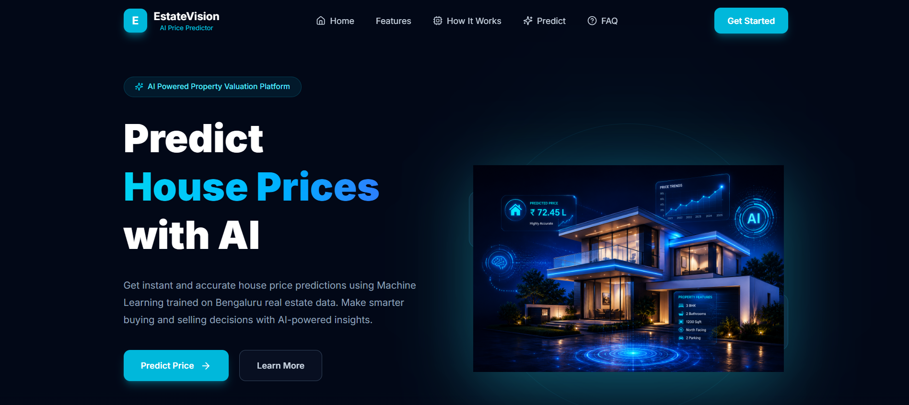

# 🏡 EstateVision AI

> An AI-powered House Price Prediction System built using **React, Flask, and Machine Learning** that predicts property prices based on user inputs such as location, area, bedrooms, bathrooms, and balconies.

---

## 📌 Overview

EstateVision AI is a full-stack machine learning web application that estimates house prices using a trained regression model. The application provides an intuitive user interface for entering property details and instantly returns the predicted property value.

This project demonstrates the integration of **Machine Learning**, **REST APIs**, and a modern **React frontend**.

---

## 🚀 Features

- 🤖 AI-powered house price prediction
- 📍 Dynamic location selection
- 📐 Predicts based on:
  - Location
  - Total Area (sq.ft)
  - Bedrooms (BHK)
  - Bathrooms
  - Balconies
- ⚡ Real-time prediction using Flask REST API
- 🎨 Modern responsive UI built with React & Tailwind CSS
- 📱 Mobile-friendly design
- 🌙 Premium dark theme

---

# 🖼️ Screenshots

## Home Page



---

## Prediction Form


---

## Prediction Result


---

# 🏗️ Tech Stack

### Frontend

- React.js
- Vite
- Tailwind CSS
- Axios
- Lucide React

### Backend

- Flask
- Flask-CORS

### Machine Learning

- Python
- Scikit-learn
- NumPy
- Pandas
- Pickle

---

# 📂 Project Structure

```
EstateVision-AI/
│
├── backend/
│   ├── api/
│   ├── ml/
│   ├── routes.py
│   ├── util.py
│   └── app.py
│
├── frontend/
│   ├── src/
│   │   ├── assets/
│   │   ├── components/
│   │   ├── services/
│   │   ├── App.jsx
│   │   └── main.jsx
│   │
│   └── package.json
│
└── README.md
```

---

# ⚙️ Installation

## Clone Repository

```bash
git clone https://github.com/YOUR_USERNAME/EstateVision-AI.git
```

```bash
cd EstateVision-AI
```

---

# Backend Setup

```bash
cd backend
```

Install dependencies

```bash
pip install -r requirements.txt
```

Run Flask Server

```bash
python app.py
```

Server runs on

```
http://127.0.0.1:5000
```

---

# Frontend Setup

```bash
cd frontend
```

Install dependencies

```bash
npm install
```

Run React App

```bash
npm run dev
```

Frontend runs on

```
http://localhost:5173
```

---

# 🔗 API Endpoints

## Get Locations

```
GET /get_location_names
```

Response

```json
{
  "locations": [
    "Whitefield",
    "Indiranagar",
    "Yelahanka"
  ]
}
```

---

## Predict House Price

```
POST /predict_home_price
```

Request

```json
{
  "location": "Whitefield",
  "sqft": 1200,
  "bath": 2,
  "balcony": 1,
  "bhk": 2
}
```

Response

```json
{
  "estimated_price": 78.45
}
```

---

# 🧠 Machine Learning Workflow

```
User Input
      │
      ▼
React Frontend
      │
      ▼
Axios API Request
      │
      ▼
Flask Backend
      │
      ▼
Machine Learning Model
      │
      ▼
Predicted Price
      │
      ▼
React UI
```

---

# 🎯 Future Improvements

- ✅ Deployment on Vercel & Render
- 📊 Property price trend visualization
- 🗺️ Interactive map integration
- 📈 Price confidence score
- ❤️ Save favorite predictions
- 📄 Download prediction report as PDF

---

# 👨‍💻 Author

**S. Dharun Kumar**

- GitHub: https://github.com/DharunKumarS-code
- LinkedIn: https://www.linkedin.com/in/YOUR_LINKEDIN_USERNAME

---

# ⭐ Support

If you found this project helpful, please consider giving it a ⭐ on GitHub!

---
